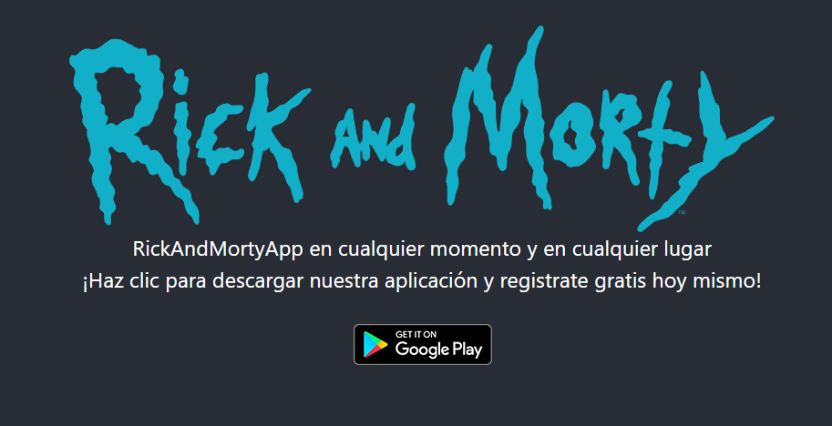
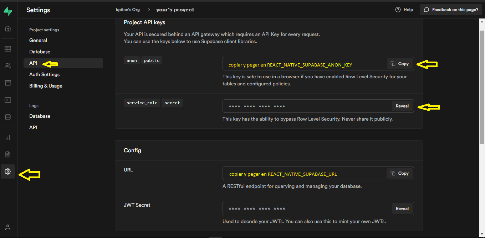
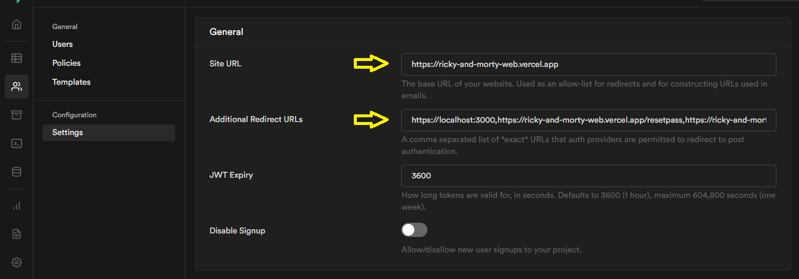

# RickAndMortyApp

---

## Challenge Desarrollo Mobile (Start Coding)

---

Configurar el entorno de desarrollo
Esta página le ayudará a instalar y crear su primera aplicación React Native.

> https://reactnative.dev/docs/environment-setup

### clonar el repo

> npm install

> npm start

> npx react-native run-android

Si todo fue correcto se habra lanzado y estara a la espera de registro o login pero antes se debera configurar el servivcio de usuarios

---

## Confugurar el servicio auth de supabase.io

Ingresar en supabase y crear un nuevo proyecto

[Link a supabase](https://api.supabase.io/platform/login)

### ingrese a su nuevo proyecto

settings>API

En el recuadro de Project API keys copie la anon key y agregelo a la variable>REACT_NATIVE_SUPABASE_ANON_KEY dentro de su archivo .env

En el recuadro de Config copie la URL y agregelo a la variable REACT_NATIVE_SUPABASE_URL dentro de su archivo .env

ingrese a proyecto=>settings=>auth settings
agregue

#### En site URL

> https://ricky-and-morty-web.vercel.app

#### En Additional Redirect URLs

> https://localhost:3000,https://ricky-and-morty-web.vercel.app/resetpass,https://ricky-and-morty-web.vercel.app/welcome
> en Additional Redirect URLs

PD. esta app no fue probada en IOS
